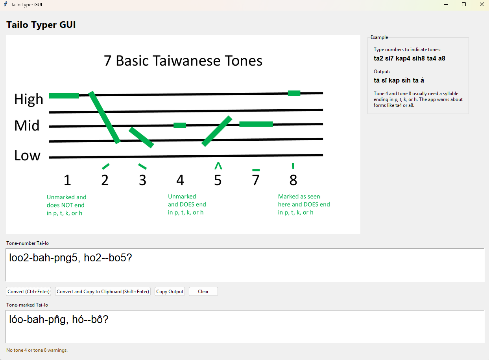

# Tailo Typer GUI



Tailo Typer GUI is a small desktop app for converting Taiwanese Hokkien Tai-lo written with tone numbers into tone-marked Tai-lo.

For example, you can type:

```text
ta2 si7
```

and the app will convert it to:

```text
tá sī
```

The app runs locally on your computer. It does not use the internet, does not use global hotkeys, and does not require AutoHotkey.


## How To Download This App From GitHub

If you are viewing this project on GitHub and are not familiar with GitHub, follow these steps:

1. Look near the top-right area of the file list for a green button labeled **Code**.
2. Click the **Code** button.
3. In the menu that opens, click **Download ZIP**.
4. Your browser will download a file named something like:

```text
tailo-typer-gui-main.zip
```

5. Find the downloaded ZIP file. It is usually in your **Downloads** folder.
6. Right-click the ZIP file and choose **Extract All** on Windows, or double-click it on Mac.
7. Open the extracted folder.
8. You should see a folder named something like:

```text
tailo-typer-gui-main
```

9. That extracted folder is the app folder. Use that folder when following the run instructions below.

You do not need a GitHub account to download the ZIP file.


## General Framework Of Installation

Before the detailed instructions, here is the basic idea:

1. Download the project from GitHub as a ZIP file.
2. Extract or unzip the ZIP file, then open the unzipped app folder.
3. Check whether Python is installed.
4. If Python is not installed, install Python.
5. Open PowerShell on Windows or Terminal on Mac, point it to the unzipped app folder with `cd`, and run the app with Python.
6. Optional: try opening the app by double-clicking `src/gui_app.py`. Step 6 is not required.

The detailed Windows and Mac instructions below walk through each of these steps slowly.

## What Is Included

Keep these files together in the same folder:

```text
tailo-typer-gui
├── README.md
├── Screenshot-v3.png
├── Taiwanese_Tones_Graphic.pdf
├── Taiwanese_Tones_Graphic.png
├── Taiwanese_Tones_Graphic_gui.png
└── src
    ├── __init__.py
    ├── gui_app.py
    └── tailo_converter.py
```

The most important files are:

- `src\gui_app.py`: the desktop app.
- `src\tailo_converter.py`: the conversion engine.
- `Taiwanese_Tones_Graphic.pdf`: the source PDF for the tones graphic shown in the app.
- `Taiwanese_Tones_Graphic.png`: the full-size rendered tones graphic image.
- `Taiwanese_Tones_Graphic_gui.png`: the resized tones graphic image shown in the app.
- `README.md`: these instructions.

Do not move `gui_app.py` away from the `src` folder unless you know how to update the file paths.

## What You Need Before Running It

You need a Windows or Mac computer with Python installed.

If Python is not already installed, do not worry. The instructions below show how to check for Python and how to install it if needed.

Use Python 3.10 or newer. Python 3.11 or 3.12 is also fine.

You do not need to install any extra Python packages.

## Windows Step 1: Download The ZIP From GitHub

If you have not downloaded the app yet, follow the **How To Download This App From GitHub** section above.

You should end up with a ZIP file named something like:

```text
tailo-typer-gui-main.zip
```

## Windows Step 2: Open The Unzipped App Folder

If you downloaded the app from GitHub as a ZIP file, you must unzip it first.

1. Find the downloaded ZIP file. It is usually in your **Downloads** folder.
2. Right-click the ZIP file.
3. Click **Extract All**.
4. Choose a place that is easy to find, such as your Desktop or Documents folder.
5. After extraction, open the unzipped folder.

The unzipped folder is your app folder. It may be named something like:

```text
tailo-typer-gui-main
```

This unzipped app folder is also the folder you will point PowerShell to in a later step. In programming instructions, this is often called the working directory.

For example, if you unzipped the folder onto your Desktop, your app folder might be located at:

```text
C:\Users\YourName\Desktop\tailo-typer-gui-main
```

If you renamed the folder to `tailo-typer-gui`, it might be located at:

```text
C:\Users\YourName\Desktop\tailo-typer-gui
```

Use the actual unzipped folder location on your own computer in the commands below.

## Windows Step 3: Check Whether Python Is Already Installed

1. Click the Windows Start button.
2. Type `PowerShell`.
3. Open **Windows PowerShell**.
4. Type this command and press Enter:

```powershell
py --version
```

If Python is installed, you should see something like:

```text
Python 3.12.3
```

The exact version number may be different. That is okay as long as it is Python 3.10 or newer.

If you see an error saying `py` is not recognized, try this command:

```powershell
python --version
```

If that shows a Python version, you can still run the app. Use `python` in the run commands instead of `py`.

If neither command works, install Python using the next section.

## Windows Step 4: Install Python If Needed

1. Go to the official Python website:

   <https://www.python.org/downloads/windows/>

2. Download the latest Windows installer.
3. Open the installer.
4. **IMPORTANT:** On the first installer screen, check the box that says:

```text
Add python.exe to PATH
```

5. Click **Install Now**.
6. Wait for installation to finish.
7. Close and reopen PowerShell.
8. Check the install by running:

```powershell
py --version
```

If you see a Python version, you are ready.

## Windows Step 5: Run The App From PowerShell

1. Open PowerShell.
2. Go to the app folder with the `cd` command.

The example below uses `C:\Path\To\tailo-typer-gui` as a placeholder. Replace it with the real location of your unzipped app folder.

For example, if your unzipped folder is on your Desktop, the command might look like this:

```powershell
cd C:\Users\YourName\Desktop\tailo-typer-gui
```

If your unzipped folder is in Documents, the command might look like this:

```powershell
cd C:\Users\YourName\Documents\tailo-typer-gui
```

Use your own Windows username and the actual unzipped folder name.

3. Run the app:

```powershell
py src\gui_app.py
```

If your computer uses `python` instead of `py`, run this instead:

```powershell
python src\gui_app.py
```

A window titled **Tailo Typer GUI** should open.

## Windows Step 6 Optional: Run The App By Double-Clicking

This step is optional. In Windows File Explorer, you may also be able to run the app by opening this file:

```text
src\gui_app.py
```

Depending on your Windows setup, double-clicking may work by itself. If it does not, try this:

1. Right-click `src\gui_app.py` in File Explorer.
2. Choose **Open with**.
3. Choose **Python** or **Python Launcher** if it appears.

If the app opens, the Tailo Typer GUI window will appear.

If this does not work, use the PowerShell method above. The PowerShell method is more reliable.

## Mac Step 1: Download The ZIP From GitHub

If you have not downloaded the app yet, follow the **How To Download This App From GitHub** section above.

You should end up with a ZIP file named something like:

```text
tailo-typer-gui-main.zip
```

## Mac Step 2: Open The Unzipped App Folder

If you downloaded the app from GitHub as a ZIP file, unzip it first.

1. Find the downloaded ZIP file. It is usually in your **Downloads** folder.
2. Double-click the ZIP file.
3. macOS will create an unzipped folder next to the ZIP file.
4. Move the unzipped folder somewhere easy to find, such as your Desktop or Documents folder.
5. Open the unzipped folder.

The unzipped folder is your app folder. It may be named something like:

```text
tailo-typer-gui-main
```

This unzipped app folder is also the folder you will point Terminal to in a later step. In programming instructions, this is often called the working directory.

For example, if you put the folder on your Desktop, it might be located at:

```text
/Users/your-name/Desktop/tailo-typer-gui-main
```

Use the actual unzipped folder location on your own computer in the commands below.

## Mac Step 3: Check Whether Python Is Already Installed

1. Open **Terminal**.
2. Type this command and press Return:

```bash
python3 --version
```

If Python is installed, you should see something like:

```text
Python 3.12.3
```

The exact version number may be different. That is okay as long as it is Python 3.10 or newer.

If Terminal says `python3` was not found, install Python using the next section.

## Mac Step 4: Install Python If Needed

1. Go to the official Python website:

   <https://www.python.org/downloads/macos/>

2. Download the latest macOS installer.
3. Open the downloaded `.pkg` file.
4. Follow the installer steps.
5. Close and reopen Terminal.
6. Check the install by running:

```bash
python3 --version
```

If you see a Python version, you are ready.

## Mac Step 5: Run The App From Terminal

1. Open Terminal.
2. Go to the app folder. For example:

```bash
cd ~/Desktop/tailo-typer-gui-main
```

If your folder is somewhere else, type `cd `, drag the unzipped app folder into the Terminal window, and press Return.

3. Run the app:

```bash
python3 src/gui_app.py
```

A window titled **Tailo Typer GUI** should open.

## Mac Step 6 Optional: Run The App By Double-Clicking

This step is optional. In Mac Finder, you may also be able to run the app by opening this file:

```text
src/gui_app.py
```

Depending on your Mac setup, double-clicking may work by itself. If it does not, try this:

1. Control-click or right-click `src/gui_app.py` in Finder.
2. Choose **Open With**.
3. Choose **Python Launcher** if it appears.

If the app opens, the Tailo Typer GUI window will appear.

If this does not work, use the Terminal method above. The Terminal method is more reliable.

## How To Use The App

1. Look at the tones chart at the top of the window.
2. Type tone-number Tai-lo in the input box.
3. Click **Convert (Ctrl+Enter)**, or press **Ctrl+Enter**, if you only want to show the tone-marked Tai-lo in the output box.
4. Click **Convert and Copy to Clipboard (Shift+Enter)**, or press **Shift+Enter**, if you want to convert the input and copy the output in one step.
5. The tone-marked Tai-lo appears in the output box.
6. Click **Copy Output** if the output is already converted and you want to copy it again.
7. Paste the copied text wherever you need it.
8. Click **Clear** to empty the input and output boxes.


## Example Input And Output

Input:

```text
ta2 si7 kap4 sih8
```

Output:

```text
tá sī kap si̍h
```

Tone 4 usually has no written tone mark, so `kap4` becomes `kap`.

Tone 8 is shown with a vertical mark, so `sih8` becomes `si̍h`.

## Tone 4 And Tone 8 Warnings

Tailo Typer GUI includes an optional warning check for tone 4 and tone 8.

In Tai-lo, syllables with tone 4 or tone 8 usually end in one of these letters:

```text
p, t, k, h
```

Examples that look okay:

```text
kap4
sih8
pak4
lik8
```

Examples that will show a warning:

```text
ta4
a8
si8
loo4
```

The warning does not stop the conversion. It is only a reminder to check the spelling.

If you type:

```text
ta4 a8
```

The app will still convert the text, but the warning area below the output box will say that those syllables use tone 4 or tone 8 without ending in `p`, `t`, `k`, or `h`.

## Clipboard Buttons

The **Convert and Copy to Clipboard (Shift+Enter)** button converts the input text and copies the converted output to your clipboard in one step.

The **Copy Output** button copies the text that is already visible in the output box to your clipboard.

That means it replaces whatever you previously copied.

This is normal clipboard behavior.

## Clear Button

The **Clear** button removes:

- the input text
- the output text
- the warning/status message

After clearing, you can type a new example.

## Troubleshooting

### The App Does Not Open When I Double-Click It

Use PowerShell instead:

```powershell
cd C:\Path\To\tailo-typer-gui
py src\gui_app.py
```

If that does not work, try:

```powershell
cd C:\Path\To\tailo-typer-gui
python src\gui_app.py
```

### PowerShell Says `py` Is Not Recognized

Try:

```powershell
python --version
```

If that works, run the app with:

```powershell
python src\gui_app.py
```

If `python` is also not recognized, install Python from the official website:

<https://www.python.org/downloads/windows/>


### Mac: Terminal Says `python3` Is Not Found

Install Python from the official macOS download page:

<https://www.python.org/downloads/macos/>

Then close and reopen Terminal and run:

```bash
python3 --version
```

### Mac: The App Does Not Open When I Double-Click It

Use Terminal instead:

```bash
cd ~/Desktop/tailo-typer-gui
python3 src/gui_app.py
```

If your folder is not on the Desktop, type `cd `, drag the `tailo-typer-gui` folder into Terminal, press Return, and then run:

```bash
python3 src/gui_app.py
```

### The Tones Chart Does Not Appear

Make sure this file is still in the main project folder:

```text
Taiwanese_Tones_Graphic.png
Taiwanese_Tones_Graphic_gui.png
```

The app expects `Taiwanese_Tones_Graphic_gui.png` to be next to `README.md`, not inside the `src` folder.

### The App Opens But Conversion Looks Wrong

Check that you are typing tone numbers immediately after each syllable, like this:

```text
ta2 si7 kap4
```

Do not put a space between the syllable and its tone number.

Use this:

```text
ta2
```

Not this:

```text
ta 2
```

## Safety Notes

This app is designed to be simple and local.

It does not:

- connect to the internet
- send your text anywhere
- read personal files
- use AutoHotkey
- use global hotkeys
- install background services

It only converts text typed into the app window.

The clipboard buttons write converted output to your clipboard only when you click them. They do not open a confirmation pop-up.

## Sharing With Friends

The safest transparent way to share this app is to share the folder as source files instead of sending an `.exe`.

That means your friends can see the Python files before running them.

To share it, send the whole `tailo-typer-gui` folder, including:

```text
README.md
Screenshot-v3.png
Taiwanese_Tones_Graphic.pdf
Taiwanese_Tones_Graphic.png
Taiwanese_Tones_Graphic_gui.png
src\gui_app.py
src\tailo_converter.py
src\__init__.py
```

Your friends will need Python installed.

On Windows, they can run:

```powershell
cd path\to\tailo-typer-gui
py src\gui_app.py
```

On Mac, they can run:

```bash
cd path/to/tailo-typer-gui
python3 src/gui_app.py
```

Replace the example path with the real folder location on their computer.

## Command-Line Converter

The original command-line converter is still available.

From the project folder on Windows, run:

```powershell
py src\tailo_converter.py ta2 si7
```

From the project folder on Mac, run:

```bash
python3 src/tailo_converter.py ta2 si7
```

This should print:

```text
tá sī
```

## License

This project is available under the MIT License.

Copyright (c) 2026 Tailo Typer GUI contributors

Permission is hereby granted, free of charge, to any person obtaining a copy
of this software and associated documentation files (the "Software"), to deal
in the Software without restriction, including without limitation the rights
to use, copy, modify, merge, publish, distribute, sublicense, and/or sell
copies of the Software, and to permit persons to whom the Software is
furnished to do so, subject to the following conditions:

The above copyright notice and this permission notice shall be included in all
copies or substantial portions of the Software.

THE SOFTWARE IS PROVIDED "AS IS", WITHOUT WARRANTY OF ANY KIND, EXPRESS OR
IMPLIED, INCLUDING BUT NOT LIMITED TO THE WARRANTIES OF MERCHANTABILITY,
FITNESS FOR A PARTICULAR PURPOSE AND NONINFRINGEMENT. IN NO EVENT SHALL THE
AUTHORS OR COPYRIGHT HOLDERS BE LIABLE FOR ANY CLAIM, DAMAGES OR OTHER
LIABILITY, WHETHER IN AN ACTION OF CONTRACT, TORT OR OTHERWISE, ARISING FROM,
OUT OF OR IN CONNECTION WITH THE SOFTWARE OR THE USE OR OTHER DEALINGS IN THE
SOFTWARE.

